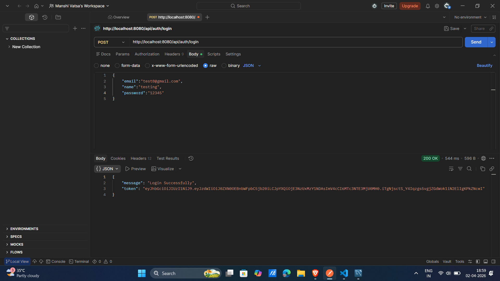
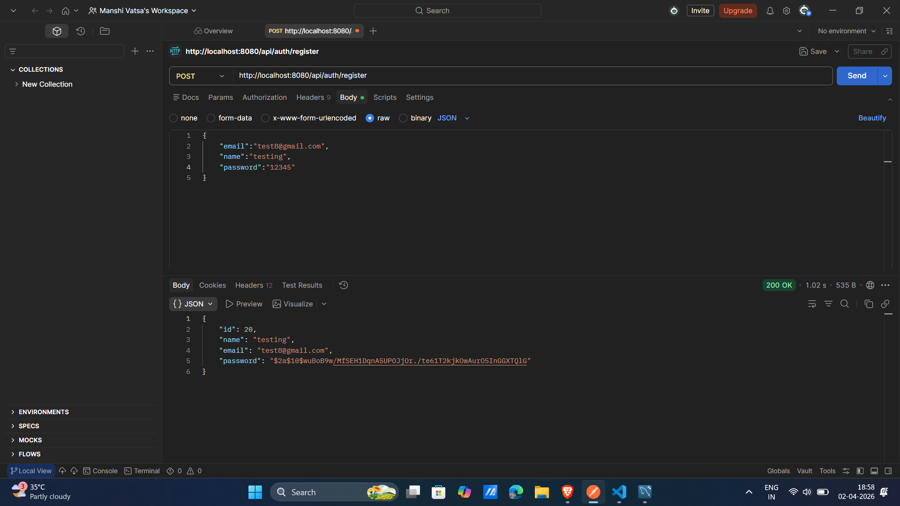
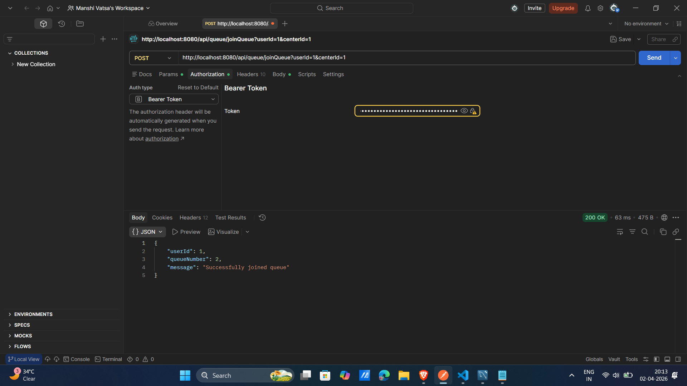
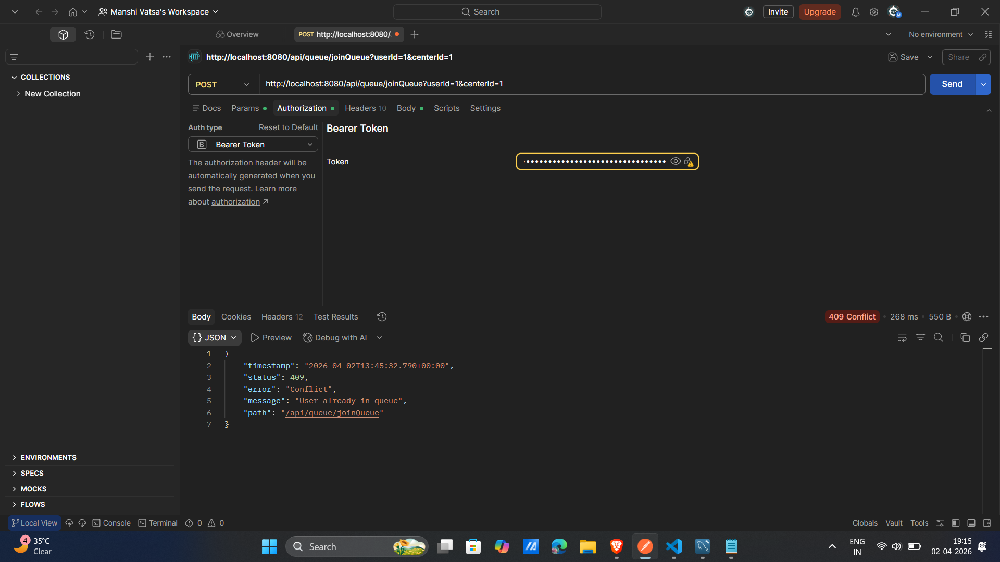
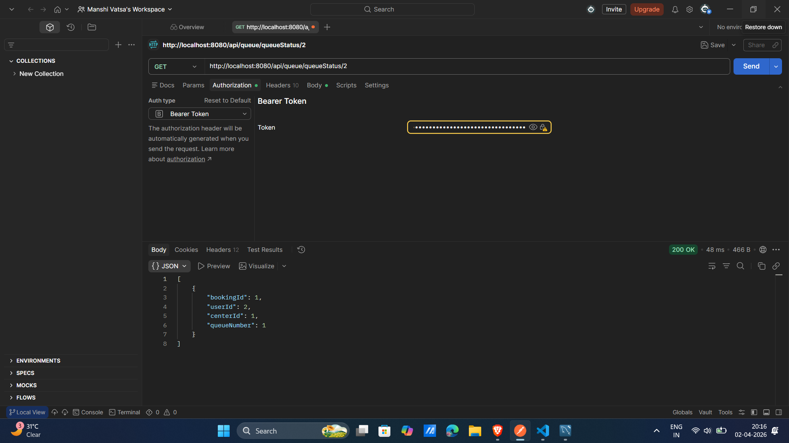
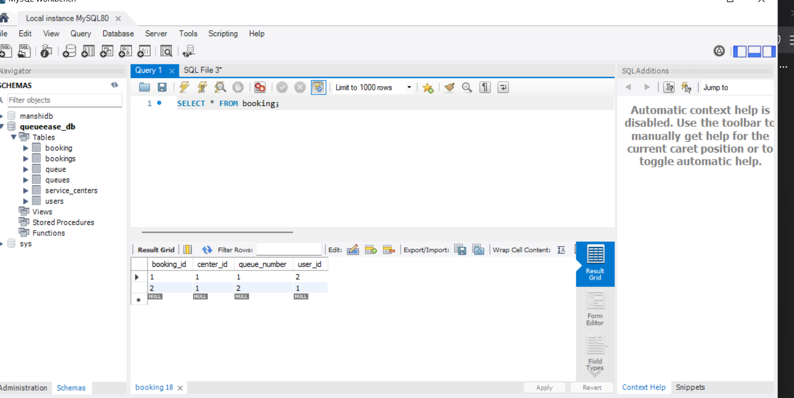

# 🚀 QueueEase Backend

## 📌 Overview
QueueEase is a backend system that allows users to join queues digitally and track their queue status in real-time.  
It eliminates physical waiting lines by providing a structured queue management system.

---

## ✨ Features
- 🔐 JWT Authentication (Login/Register)
- 📥 Join Queue API
- 📊 Real-time Queue Status
- ❌ Duplicate Booking Prevention
- 🗄 Database Integration (MySQL)

---

## 🛠 Tech Stack
- Java
- Spring Boot
- Spring Security (JWT)
- MySQL
- REST APIs

---

## 📡 API Endpoints

### 🔹 Auth APIs
- `POST /api/auth/register`
- `POST /api/auth/login`

### 🔹 Queue APIs
- `POST /api/queue/joinQueue`
- `GET /api/queue/queueStatus/{userId}`

---

## 📸 Screenshots

### 🔐 Login API
[](screenshots/login.png)

---

### 📝 Register API
[](screenshots/register.png)

---

### 📥 Join Queue (Success)
[](screenshots/join.png)

---

### ❌ Duplicate Booking Prevention
[](screenshots/duplicate.png)

---

### 📊 Queue Status
[](screenshots/queuestatus.png)

---

### 🗄 Database Proof
[](screenshots/database.png)

---

## ⚙️ How to Run

### 1️⃣ Clone Repository
```bash
git clone https://github.com/your-username/queueease-backend.git
cd queueease-backend